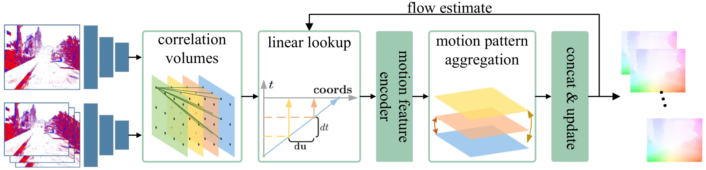

# [[ICCV-2023] TMA: Temporal Motion Aggregation for Event-based Optical Flow](https://arxiv.org/abs/2303.11629)

<p align="center"></p>

This is the official codebase for the paper **TMA: Temporal Motion Aggregation for Event-based Optical Flow**.

## Datasets
### DSEC
The DSEC dataset for optical flow can be downloaded [here](https://dsec.ifi.uzh.ch/dsec-datasets/download/).


## Experiments
### DSEC Dataset Preparation
Some preprocess is helpful to save training time. We use pre-generated event volumes saved in `.npz` files and flows in `.npy` files. Basically, we follow the data preprocess in [E-RAFT](https://github.com/uzh-rpg/E-RAFT).

We put data in `dsec` folder, and the structure should be like this:
```
|-dsec
    |-train
        |-thun_00_a
          |-seq_000000.npz
          |-seq_000000.npy
          |-seq_000001.npz
          |-seq_000001.npy
          ...
        |-zurich_city_02_a
          |-seq_000000.npz
          |-seq_000000.npy
          |-seq_000001.npz
          |-seq_000001.npy
          ...
        |-zurich_city_02_d

   |-test
        |-interlaken_00_b
          |-seq_xxxxxx.npz
          |-seq_xxxxxx.npz
        |-interlaken_01_a
          |-seq_xxxxxx.npz
          |-seq_xxxxxx.npz
```
For `train` data, each `.npz` file contains two consecutive event volumes named `voxel_prev` and `voxel_curr`, each `.npy` file contains corresponding 16-bit optical flow.

For `test` data, the `.npz` file is indexed by test timestamp, which is useful for generating predictions for [online benchmark](https://dsec.ifi.uzh.ch/uzh/dsec-flow-optical-flow-benchmark/).

### Event volumes generation
```
cd data_preprocess
python event_volume_generation.py --event_path 'DSEC/train_events' --gt_path 'DSEC/train_optical_flow' --dst 'dsec/'
```

```--event_path```: Path where you stored original DSEC train_events.

```--gt_path```: Path where you stored DSEC-Flow train_optical_flow.

```--dst```: Path where you will output event volumes and gt flows.
### Training Full DSEC-Flow dataset
```
sh train.sh
```
Please choose your expected folder name to save your checkpoints. By default, `ckpts/` is used.

### Arguments
```--root``` : Path where you stored the dataset, here we use  `dsec/` for convenience.

```--checkpoint_dir``` : Path to save checkpoints, here we use `ckpts/` for convenience.

```--wandb``` : Optional, if you want to visualize training loss.


### Training DSEC-Flow split for developing model (Optional)
```
python train_split.py --checkpoint_dir 'your_checkpoint_dir/'
```
Please assign a directory to save checkpoints by `--checkpoint_dir`. 

If you want to use wandb to visualize the loss, `--wandb` is optional.

Please change the directory of pre-generated event volumes in `datasets/DSEC_split_loader.py`, line `19-24`.

We also provide a split example in `DSEC_split/train/split_example.txt` and `DSEC_split/test/split_example.txt`.


### Citation
If you find this codebase helpful for your research, please cite our paper:

```
@inproceedings{liu2023tma,
  title={TMA: Temporal Motion Aggregation for Event-based Optical Flow},
  author={Liu, Haotian and Chen, Guang and Qu, Sanqing and Zhang, Yanping and Li, Zhijun and Knoll, Alois and Jiang, Changjun},
  booktitle={ICCV},
  year={2023},
}
```

### Contact
If you have any concerns about this codebase or our paper, please feel free to drop me an E-mail.
- 2011458@tongji.edu.cn
- liuhaotian49@gmail.com


